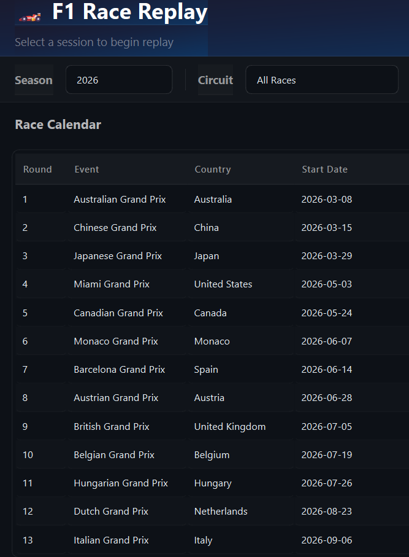
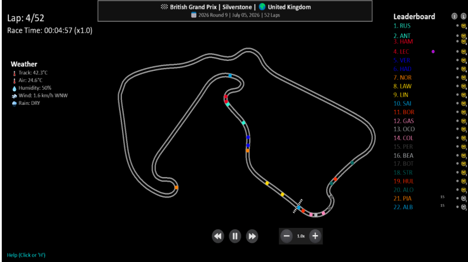
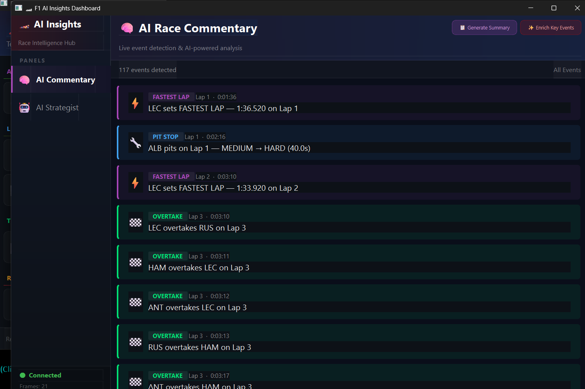
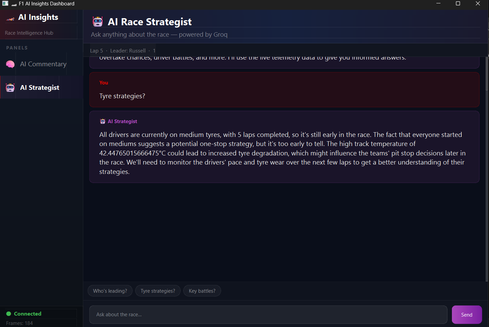

<div align="center">
  <h1>🏎️ F1 Race Replay & AI Insights</h1>
  <p><i>An interactive application designed to visualize and replay Formula 1 races with deep telemetry and AI-driven insights.</i></p>
</div>

---

F1 Race Replay brings Formula 1 data to life. Built using **Python**, **PySide6**, and the **FastF1** library, this tool provides rich telemetry insights, track visualizations, real-time event detection, and an arcade-style replay experience. 

## 📸 Application Showcase

| Race Selection | Arcade Replay Viewer |
|:---:|:---:|
|  |  |
| **AI Race Commentary** | **AI Race Strategist** |
|  |  |

---

## 🌟 Key Features

- 🏎️ **Race & Qualifying Replays**: Visualize sessions (Race, Sprint, Qualifying) with highly accurate telemetry data.
- 📊 **Telemetry Insights**: Dive deep into driver telemetry, dynamic tyre degradation, and track statuses.
- 🤖 **AI Race Insights**: Leverage Groq-powered AI commentary and live race strategist capabilities.
- 🎮 **Arcade Viewer**: Enjoy a stylized, arcade-like replay with HUD panels and track layout rotation options.
- 🖥️ **Dual Interfaces**: Launch an intuitive GUI to select events or run replays directly from your terminal using the CLI.

---

## ⚙️ Installation

Ensure you have Python installed. The required dependencies are listed in `requirements.txt`.

1. **Clone the repository:**
   ```bash
   git clone https://github.com/yourusername/f1-race-replay.git
   cd f1-race-replay
   ```

2. **Install the dependencies:**
   ```bash
   pip install -r requirements.txt
   ```

---

## 🚀 Usage

### 🖥️ Running via GUI
To launch the beautiful graphical race selection window, simply run:
```bash
python main.py
```

### 💻 Running via CLI
You can launch replays directly using command-line arguments:
```bash
python main.py --cli
```

**Example CLI Commands & Flags:**
- `python main.py --viewer --year 2023 --round 12` : Launch directly into the 2023 Round 12 Race replay.
- `--qualifying` or `--sprint` or `--sprint-qualifying` : Target a specific session instead of the main Race.
- `--no-hud` : Hide the HUD during the replay for a cinematic view.
- `--list-rounds` / `--list-sprints` : List available rounds and sprints for a specific year.

---

## 🏗️ Architecture & Data Sources

- Powered by **FastF1** for fetching official Formula 1 telemetry and timing data.
- Implements a sophisticated **Tyre Degradation Model** and **Real-Time Event Detector**.
- Results and telemetry data are automatically cached locally (in `.fastf1-cache`) to speed up subsequent loads drastically.

## 📄 License
This project is open-source. Please see the license file for more details.
